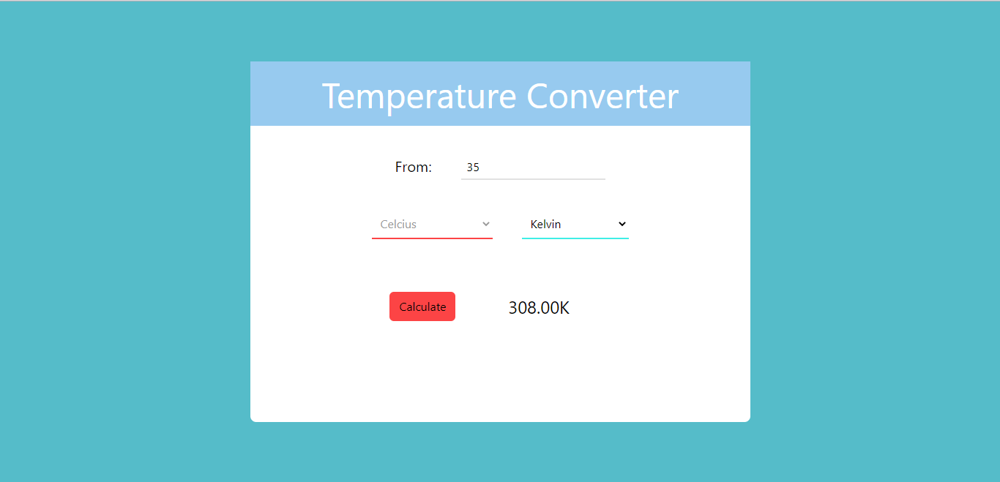

# Temperature_Converter

Temperature Converter: This project converts temperature from one unit to another celcius to farenheit or kelvin and vice versa. It was developed with react-redux.. it has a full mobile responsiveness

## Getting Started

Clone or download this repository and run with a local server of open `index.html` with your favorite browser

## Prequisite

- Your browser version must be recent for a better experience

## Features

- Conversion Page

## Tech/framework used

- HTML
- CSS
- ReactJS
- Vite
- Tailwind-CSS

## Preview

[Preview Here](https://temperature-converter-kappa.vercel.app/)

## Contact

If you want to contact me you can reach me at
-wolabash@gmail.com -https://github.com/PrimeFord

## Addtional Info

- This is one of the series of project for the @Codevillage Programming Lessons.
- This is not meant for production. It's for learning purpose only
